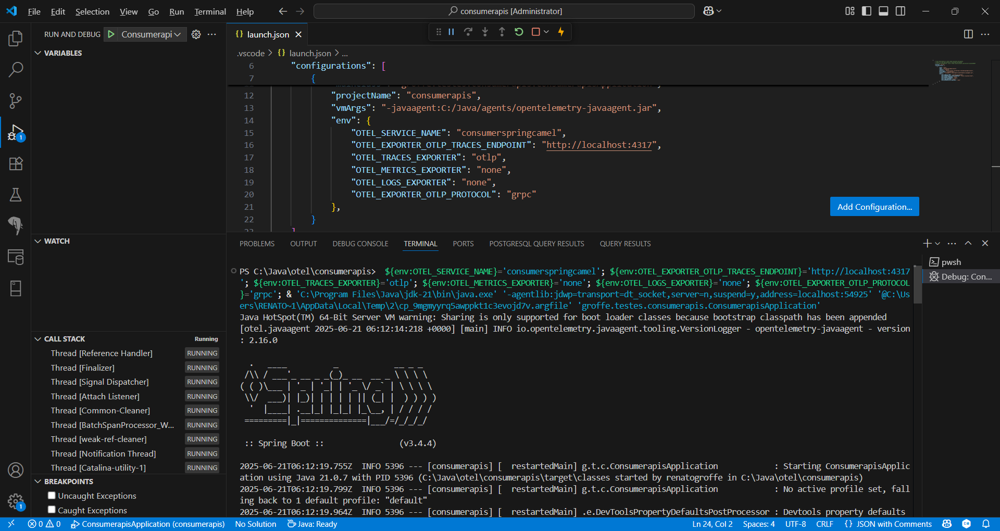
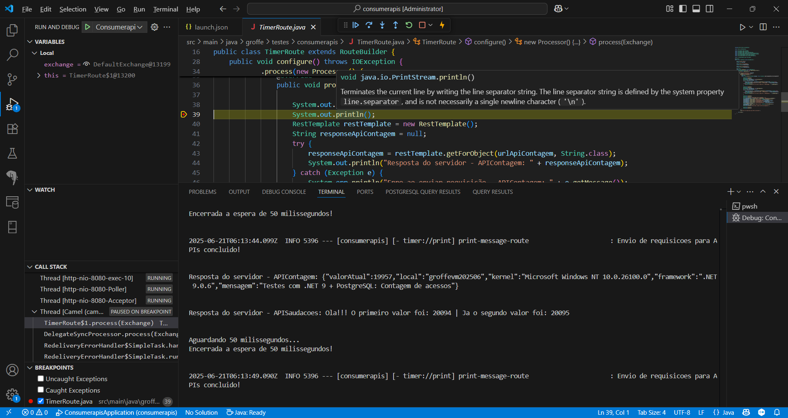

# java-spring-camel-vscode-otel-jaeger-postgres-mysql_consumoapis
Exemplo de aplicação criada com Java + Spring + Apache Camel e utilizando Distributed Tracing com Jaeger + OpenTelemetry (configurando porta do Collector) e consumindo APIs REST (uma destas depende de bases PostgreSQL + MySQL). Inclui Docker Compose de ambiente que faz uso de soluções como Jaeger + configurações para execução via VS Code.

APIs REST utilizadas por este projeto:
- [**Contagem de acessos (.NET 9 + ASP.NET Core)**](https://github.com/renatogroffe/aspnetcore9-otel-jaeger-postgres-mysql_apicontagem)
- [**Saudações (Node.js)**](https://github.com/renatogroffe/nodejs-otel-jaeger_apisaudacoes)

Agents Java do OpenTelemetry: **https://github.com/open-telemetry/opentelemetry-java-instrumentation/releases**

Variáveis de ambiente a serem configuradas para uso de tracing distribuído com Jaeger:

| Variável                          | Valor                   |
|-----------------------------------|-------------------------|
| OTEL_EXPORTER_OTLP_PROTOCOL       | grpc                    |
| OTEL_EXPORTER_OTLP_TRACES_ENDPOINT| http://localhost:4317   |
| OTEL_LOGS_EXPORTER                | none                    |
| OTEL_METRICS_EXPORTER             | none                    |
| OTEL_SERVICE_NAME                 | consumerspringcamel     |
| OTEL_TRACES_EXPORTER              | otlp                    |

Essas variáveis e o parâmetro carregando o Agent do OpenTeletry (**vmArgs**) foram configurados no arquivo **launch.json**, para debugging a partir do Visual Studio Code:

```json
{
    // Use IntelliSense to learn about possible attributes.
    // Hover to view descriptions of existing attributes.
    // For more information, visit: https://go.microsoft.com/fwlink/?linkid=830387
    "version": "0.2.0",
    "configurations": [
        {
            "type": "java",
            "name": "ConsumerapisApplication",
            "request": "launch",
            "mainClass": "groffe.testes.consumerapis.ConsumerapisApplication",
            "projectName": "consumerapis",
            "vmArgs": "-javaagent:C:/Java/agents/opentelemetry-javaagent.jar",
            "env": {
                "OTEL_SERVICE_NAME": "consumerspringcamel",
                "OTEL_EXPORTER_OTLP_TRACES_ENDPOINT": "http://localhost:4317",
                "OTEL_TRACES_EXPORTER": "otlp",
                "OTEL_METRICS_EXPORTER": "none",
                "OTEL_LOGS_EXPORTER": "none",
                "OTEL_EXPORTER_OTLP_PROTOCOL": "grpc"
            },
        }
    ]
}
```

Aplicação em execução através do Visual Studio Code:



Debugging da aplicação:

